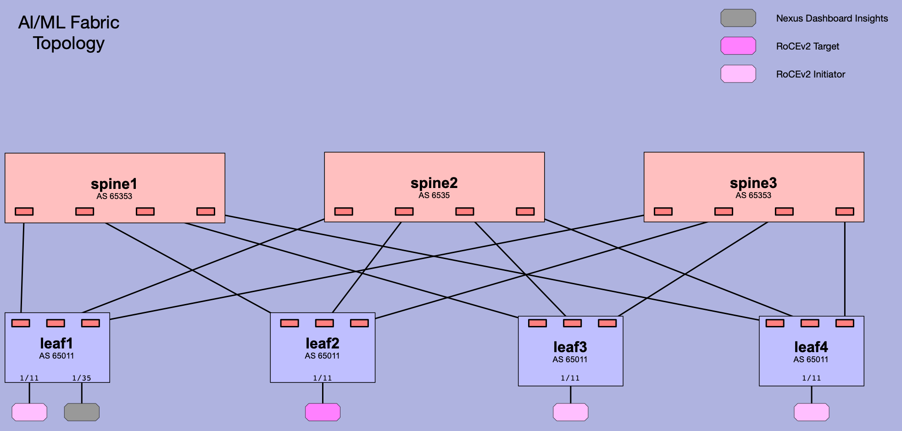

# NDFC-AIML-Fabric

## About

This repository contains a playbook that will create a fabric, using Cisco's Nexus Dashboard Fabric Controller (NDFC), which support AI/ML workloads.

## Fabric Characteristics



- 3 Spines
- 4 Leafs
- eBGP Spine - Leaf peering
- Spines are in BGP ASN 65535
- Leafs are in BGP ASC 65011
- Leaf1 access-mode interface Eth1/35 connects to Nexus Dashboard Insights over vlan 3967 for monitoring the fabric
- Leaf1 is configured with Precision Time Protocol (PTP) for 
- All Leafs are provisioned with interfaces to connect to RoCEv2 hosts.
- RoCEv2 Target host is located on leaf2 interface Ethernet1/11

## Installation and Usage

### 1. Install cisco.dcnm Ansible Collection 

The Ansible playbook in this repo requires that the cisco.dcnm Collection be installed.

```bash
ansible-galaxy collection install cisco.dcnm
```

## 2. Ansible Custom Configuration

DCNM/NDFC requires increasing the default timeout for persistent connections from the default of 30 seconds to >= 1000 seconds.  We have provided an ansible.cfg file with the requisite changes in this repo's top-level directory.  If you would rather edit your existing ansible.cfg file (where ever it is), the changes are shown below.

```bash
[persistent_connection]
command_timeout=1800
connect_timeout=1800
```

### 3. Modify ./inventory/group_vars/ndfc

#### Edit ``ansible_password`` (password for NDFC controller) and ``device_password`` (password for NX-OS switches)

Add ``ansible_password`` and ``device_password`` in encrypted format (or non-encrypted, if you don't care about security).  These are the passwords you use to login to your DCNM/NDFC Controller, and NX-OS switches, respectively.

To add encrypted passwords for the NDFC controller and NX-OS devices, issue the following from this repo's top-level directory.  The lines containing ``echo`` are to ensure carraige returns are added after each line that ``ansible-vault`` adds.

```bash
ansible-vault encrypt_string 'mySuperSecretNdfcPassword' --name 'ansible_password' >> ./inventory/group_vars/ndfc
echo "\n" >> ./inventory/group_vars/ndfc
ansible-vault encrypt_string 'mySuperSecretNxosPassword' --name 'device_password' >> ./inventory/group_vars/ndfc
echo "\n" >> ./inventory/group_vars/ndfc
```

ansible-vault will prompt you for a vault password each time it's invoked, which you'll use to decrypt these passwords (using ``ansible-playbook --ask-vault-pass``) when running the example playbooks.

Example:

```bash
% ansible-vault encrypt_string 'mySuperSecretNdfcPassword' --name 'ansible_password' >> ./inventory/group_vars/ndfc
New Vault password: 
Confirm New Vault password: 
echo "\n" >> ./inventory/group_vars/ndfc
% cat ./inventory/group_vars/ndfc
ansible_password: !vault |
          $ANSIBLE_VAULT;1.1;AES256
          35313565343034623966323832303764633165386439663133323832383336366362663431366565
          6238373030393562363831616266336464353963393566300a316564663135323263653165393330
          33353935396462663531323437336366653937326234313866623535313431366534363938633834
          6563336634653963320a376364323430316134623430636265383561663631343763646465626365
          36666366333438373537343033393939653830663061623362613439376161626439

%

```

If you don't care about security, you can add a non-encrypted password by editing the file directly.
The following are example unencrypted passwords for the NDFC controller and NX-OS devices added to this file:

```bash
ansible_password: mySuperSecretNdfcPassword
device_password: mySuperSecretNxosPassword
```

#### Edit ``ansible_user``

Change ``ansible_user`` in the same file to the username associated with the above password that you're using on DCNM/NDFC.
Change ``device_username`` in the same file to the username used to login to your NX-OS switches.

Example:

```bash
ansible_user: voldomort
device_username: admin
```

### 4. Update ``./inventory/hosts/hosts`` with the IP address of your DCNM/NDFC Controller

```bash
% cat ./inventory/hosts/hosts 
---
ndfc:
  hosts:
    ndfc1:
      ansible_host: 192.168.1.1
```

### 5. Import the file ``./AI_Cluster_QOS_template.template`` into your NDFC instance.

Operations -> Templates -> Actions -> Import

### 6. Update the vars section of the ``AIML_Fabric.yml`` playbook with the IP addresses and serial numbers of your switches, and with the PTP source IP that we are configuring on leaf1.


### Run the playbook

#### If you encrypted your NDFC password:

```bash
cd /top/level/directory/for/this/repo
ansible-playbook AIML_Fabric.yml -i inventory --ask-vault-pass 
```

When prompted, enter the password you used in response to the ansible-vault command in step 1 above.

#### Or, if you didn't encrypt the NDFC password:

```bash
cd /top/level/directory/for/this/repo
ansible-playbook AIML_Fabric.yml -i inventory
```
